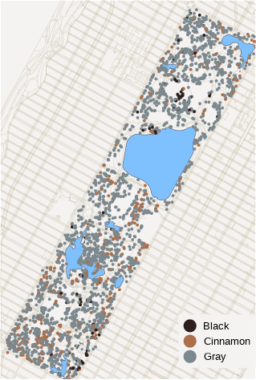

# 🐿️ Central Park Squirrel Census Analysis

This project explores the spatial distribution of squirrels in Central Park, NYC, by combining data from OpenStreetMap and observational records. The resulting visualization provides a clear representation of where different fur color variations are found, offering insights into squirrel behavior and habitat preferences in an urban environment.



**📦 Install Required Packages**: Use the following command to install the necessary R packages:
   ```R
   install.packages(c("tidyverse", "janitor", "osmdata", "showtext", "sf"))
